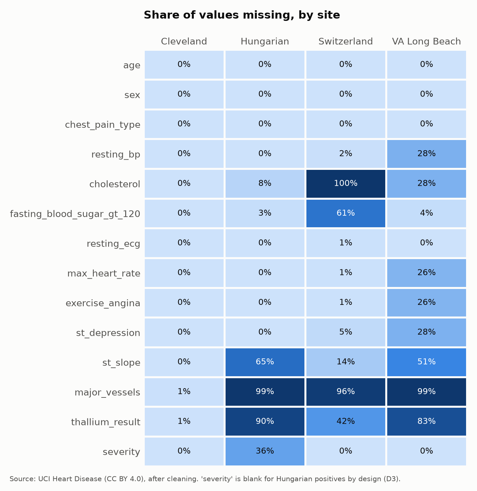
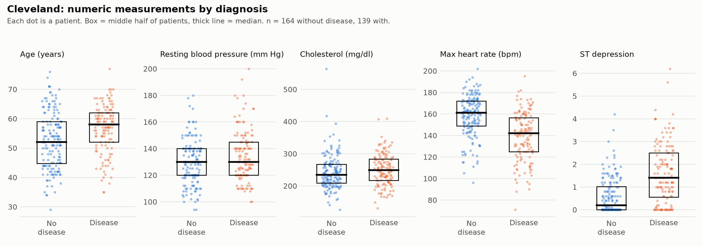
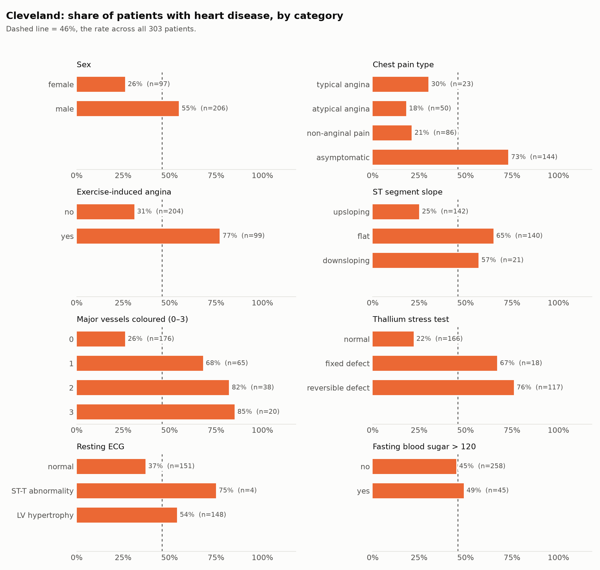
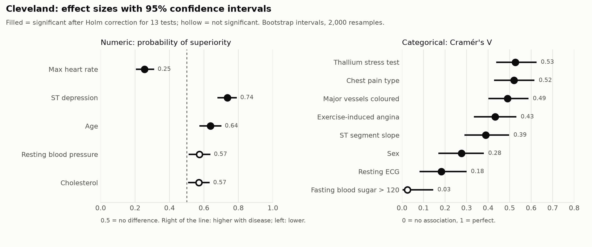
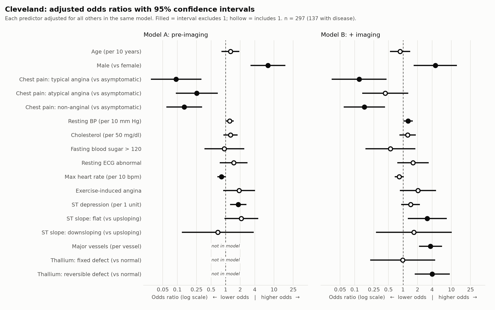
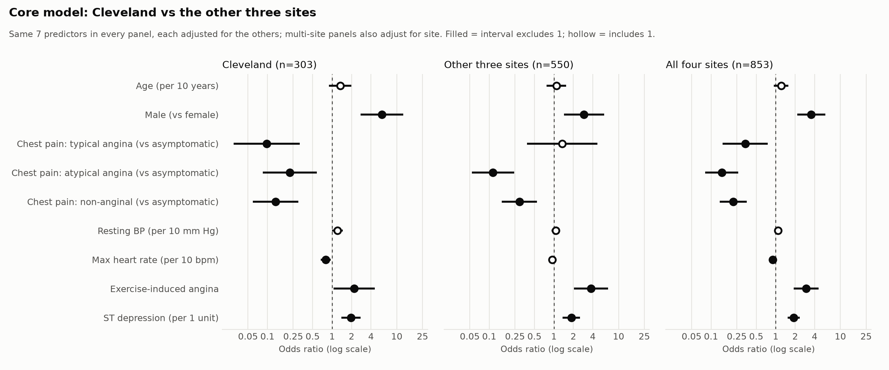

# UCI Heart Disease — An End-to-End Analytics Case Study

A structured, fully documented case study exploring which clinical measurements
are associated with the presence of heart disease, using the UCI Heart Disease
dataset. The project is deliberately split into four phases, each committed
separately, so the git history shows how the work actually progressed.

## Roadmap

- [x] **1. Gathering** — download the data reproducibly, verify license and structure
- [x] **2. Cleaning** — handle missing values, fix types, decode categories, document every decision
- [x] **3. Analysis** — exploratory analysis and statistical comparisons: Cleveland as the primary sample, all four sites as a robustness check
- [ ] **4. Reporting** — findings, limitations, and visual summary

## Repository structure

```
.
├── data/
│   ├── raw/          # original downloads — never edited by hand
│   └── processed/    # outputs of the cleaning phase
├── notebooks/        # exploration and analysis notebooks
├── src/              # reusable scripts (e.g. data download)
├── reports/
│   └── figures/      # final charts
├── requirements.txt  # pinned dependencies
└── README.md
```

## Setup

```bash
python3 -m venv .venv
source .venv/bin/activate
pip install -r requirements.txt

python src/download_data.py      # fetch raw files into data/raw/ and verify checksums
python src/check_structure.py    # read-only report comparing the files to the documentation
python src/clean_data.py         # write data/processed/heart_clean.csv
```

## Data source & license

| | |
|---|---|
| **Dataset** | Heart Disease, UCI Machine Learning Repository (dataset #45) |
| **Page** | https://archive.ics.uci.edu/dataset/45/heart+disease |
| **Files from** | https://archive.ics.uci.edu/ml/machine-learning-databases/heart-disease/ |
| **DOI** | [10.24432/C52P4X](https://doi.org/10.24432/C52P4X) |
| **License** | [Creative Commons Attribution 4.0 International (CC BY 4.0)](https://creativecommons.org/licenses/by/4.0/) — sharing and adaptation allowed for any purpose with appropriate credit |
| **Collected at** | Cleveland Clinic Foundation; Hungarian Institute of Cardiology, Budapest; University Hospitals of Zurich and Basel; V.A. Medical Center, Long Beach |
| **Donated** | July 1988 |
| **Downloaded** | 2026-09-24 |

**Citation** (as given by UCI):

> Janosi, A., Steinbrunn, W., Pfisterer, M., & Detrano, R. (1989). Heart Disease
> [Dataset]. UCI Machine Learning Repository. https://doi.org/10.24432/C52P4X.

Because the license is CC BY 4.0, the raw files are redistributed in
`data/raw/` with this attribution. Their SHA-256 checksums are pinned in
`data/raw/SHA256SUMS`; `python src/download_data.py --verify` confirms a copy
is byte-for-byte identical to the one analysed here.

### Files used

| File | Site | Rows |
|---|---|---|
| `processed.cleveland.data` | Cleveland Clinic Foundation | 303 |
| `processed.hungarian.data` | Hungarian Institute of Cardiology | 294 |
| `processed.switzerland.data` | University Hospitals Zurich & Basel | 123 |
| `processed.va.data` | V.A. Medical Center, Long Beach | 200 |
| `heart-disease.names` | Documentation | — |

920 rows in total. Each file is comma-separated with no header row and 14
columns; missing values are written as `?`.

### Data dictionary

From `heart-disease.names`, which documents 76 original attributes; the
processed files keep these 14.

| Column | Meaning | Values |
|---|---|---|
| `age` | Age | years |
| `sex` | Sex | 1 = male, 0 = female |
| `cp` | Chest pain type | 1 = typical angina, 2 = atypical angina, 3 = non-anginal pain, 4 = asymptomatic |
| `trestbps` | Resting blood pressure on admission | mm Hg |
| `chol` | Serum cholesterol | mg/dl |
| `fbs` | Fasting blood sugar > 120 mg/dl | 1 = true, 0 = false |
| `restecg` | Resting ECG result | 0 = normal, 1 = ST-T wave abnormality, 2 = probable/definite left ventricular hypertrophy |
| `thalach` | Maximum heart rate achieved | beats per minute |
| `exang` | Exercise-induced angina | 1 = yes, 0 = no |
| `oldpeak` | ST depression induced by exercise relative to rest | unit not stated (conventionally mm) |
| `slope` | Slope of the peak exercise ST segment | 1 = upsloping, 2 = flat, 3 = downsloping |
| `ca` | Major vessels coloured by fluoroscopy | 0–3 |
| `thal` | Thallium stress test result | 3 = normal, 6 = fixed defect, 7 = reversible defect |
| `num` | Angiographic diagnosis (the target) | 0 = < 50% narrowing (no disease); 1–4 = disease present |

### Where the files differ from the documentation

`src/check_structure.py` compared the files against `heart-disease.names`.
Row counts and all categorical codes match, except for the points below. None
are fixed here — raw data stays untouched — they are inputs to the cleaning
phase.

1. **Missing-value marker.** The documentation says `-9.0`; the processed files
   use `?` and contain no `-9` at all.
2. **Diagnosis levels.** The documentation describes `num` as 0/1, but its own
   class-distribution table and three of the files use 0–4. The **Hungarian**
   file uses only 0/1: its 106 cases coded `1` equal the 37 + 26 + 28 + 15
   documented for levels 1–4, so severity was collapsed there. Only
   presence/absence (0 vs. ≥ 1) is comparable across all four sites.
3. **Zeros that mean "not recorded".** `chol` is `0` for all 123 Switzerland
   rows and 49 VA rows, and `trestbps` is `0` for one VA row. These are not
   physiological values and must be treated as missing.
4. **Unevenly missing columns.** Cleveland is nearly complete. At the other
   sites `ca` is 96–99% missing, `thal` 42–90%, and `slope` 14–65%.
5. **Negative `oldpeak`.** 12 rows (11 Switzerland, 1 VA) have ST *elevation*
   recorded as negative depression. Plausible, but worth noting.
6. **Duplicates.** Two pairs of identical rows (one pair within Hungarian, one
   within VA). With no patient ID they may be repeated records or two patients
   with identical measurements.

**Why UCI and not Kaggle?** A widely shared Kaggle version (`heart.csv`, 1,025
rows) consists largely of duplicated records of the same ~300 patients. This
project pulls the original files directly from the UCI Machine Learning
Repository so the sample size and provenance are honest.

## Cleaning decisions

`src/clean_data.py` turns the four raw files into one table,
`data/processed/heart_clean.csv` (920 rows, 18 columns). Raw files are never
modified, and the script checks its own output (no rows lost, no code left
unmapped, no zero cholesterol or blood pressure left) before writing anything.

| # | Decision | Why |
|---|---|---|
| D1 | Read `?` as missing | It is the marker the files actually use (finding 1) |
| D2 | `cholesterol` and `resting_bp` values of `0` → missing (172 and 1 cells) | Zero is physiologically impossible; these sites used it for "not measured" (finding 3) |
| D3 | Target split into `disease` (true if `num` ≥ 1) and `severity` (0–4) | `disease` is comparable across all sites. `severity` is left missing for the 106 Hungarian positives, whose levels were collapsed (finding 2), so it can't be misread as "severity 1" |
| D4 | Codes decoded to labels (e.g. `cp` 4 → `asymptomatic`); yes/no columns → `True`/`False`; counts and whole-number measurements stored as integers | Readable output with no codebook needed; the mapping is in the data dictionary above |
| D5 | Columns renamed (e.g. `trestbps` → `resting_bp`, `thalach` → `max_heart_rate`, `oldpeak` → `st_depression`) | Self-explanatory names for analysis and charts |
| D6 | Added `record_id` (e.g. `va-042` = line 42 of `processed.va.data`) and `site` | Any cleaned row can be traced back to its raw line; site is needed because the sites differ sharply |
| D7 | The 2 pairs of identical rows are kept and flagged `possible_duplicate` | With no patient ID they can't be proven to be repeats; the flag lets analysis test both ways (finding 6) |
| D8 | Negative `st_depression` kept as recorded | Plausibly ST elevation, not an error (finding 5) |

**Loading the cleaned data.** A CSV can't store column types, so read it with
`load_clean()` rather than `pd.read_csv`. It restores whole numbers as
nullable integers, yes/no columns as nullable booleans, and categories in
their documented order (e.g. chest pain types 1–4, not alphabetical), and
refuses to run if a label in the file isn't a known category:

```python
import sys; sys.path.insert(0, "src")
from clean_data import load_clean
df = load_clean()
```

**Verified in [`notebooks/02_cleaning_check.ipynb`](notebooks/02_cleaning_check.ipynb):**
every difference between raw and clean is explained by a decision above (only
173 zero values were removed; all other kept values are identical; every code
maps to its documented label), and sample rows trace back to their raw lines.



**Deliberately left for the analysis phase:** dropping rows, filling in
missing values, and choosing which sites to analyse. Those depend on the
question being asked. Missing values stay as empty cells.

**What the cleaned data shows up front:**

| Site | Rows | Disease present |
|---|---|---|
| Cleveland | 303 | 46% |
| Hungarian | 294 | 36% |
| Switzerland | 123 | 93% |
| VA Long Beach | 200 | 74% |

Only 299 of the 920 rows (297 of them Cleveland) have no missing values
(ignoring `severity`). The sites also differ a lot in how common disease is,
so pooled results would partly reflect *which hospital* a patient came from.

**Analysis plan (Phase 3).** Because of this, the analysis runs twice:

- **Primary: Cleveland only.** 303 patients with all 13 predictors, nearly
  complete.
- **Robustness check: all four sites.** 920 patients, limited to the core
  measurements present at every site (age, sex, chest pain type, resting blood
  pressure, max heart rate, exercise angina, ST depression), with site taken
  into account. A finding that holds in both is more trustworthy than one that
  appears in only one.

**Step 1: Cleveland profile** ([`notebooks/03_cleveland_profile.ipynb`](notebooks/03_cleveland_profile.ipynb)).
One variable at a time, no tests yet. The clearest differences between patients
with and without disease are max heart rate, ST depression, exercise angina,
chest pain type, ST slope, vessel count and thallium result. Cholesterol,
resting blood pressure and fasting blood sugar barely differ. That is
plausibly because every patient was already referred for angiography.




**Step 2: effect sizes and tests** ([`notebooks/04_cleveland_tests.ipynb`](notebooks/04_cleveland_tests.ipynb),
table in [`reports/cleveland_tests.csv`](reports/cleveland_tests.csv)). Each
predictor gets an effect size with a 95% bootstrap confidence interval and a
p-value with Holm correction for 13 tests. Numeric predictors use a
Mann–Whitney test and probability of superiority; categorical predictors use a
chi-square test (permutation-based where cells are small) and Cramér's V.
10 of 13 remain significant after correction. Cholesterol and resting blood
pressure pass at p < 0.05 uncorrected but not after correction, and their
effects are small. Fasting blood sugar shows no association.



**Step 3: predictors together** ([`notebooks/05_cleveland_model.ipynb`](notebooks/05_cleveland_model.ipynb),
table in [`reports/cleveland_logistic_regression.csv`](reports/cleveland_logistic_regression.csv)).
There are two logistic regressions. Model A uses only measurements taken before specialised
imaging (11 predictors); Model B adds vessel count and thallium result. Once
predictors are adjusted for each other:

- **Age** is no longer clear. It overlaps with max heart rate and vessel count.
- **Sex** gets *stronger*: odds ratio for men 7.5, against 3.6 unadjusted.
- **Asymptomatic chest pain** still has much higher odds than any chest pain type.
- **The four exercise-test measurements** overlap. Only ST depression and max
  heart rate stay clear in Model A.

The imaging improves the model significantly, but its cross-validated AUC
only rises from 0.87 to 0.90.



**Step 4: four-site robustness check** ([`notebooks/06_four_site_check.ipynb`](notebooks/06_four_site_check.ipynb),
table in [`reports/four_site_logistic_regression.csv`](reports/four_site_logistic_regression.csv)).
This step refits a core model with the 7 predictors recorded at every site. It is
fitted at Cleveland, at the other three sites (550 patients the earlier analysis
never saw, with a site term), and at all four together (853 patients).

- **Replicates:** ST depression (OR 1.97 at Cleveland vs 1.86 elsewhere),
  exercise-induced angina, male sex, and the lower odds for atypical and
  non-anginal chest pain compared with no chest pain.
- **Does not replicate:** typical angina's low odds (0.10 at Cleveland vs
  1.35 elsewhere; interaction p = 0.003). This rests on only 23 and 18 patients.
- **Weaker elsewhere:** max heart rate.
- **Transport:** a model fitted at Cleveland ranks Hungarian patients as well
  as its own (AUC 0.87). It does worse at Switzerland and VA (0.75, 0.73),
  where almost every patient has disease, and it under-predicts Switzerland's
  risk (70% predicted vs 93% observed).
- **Sensitivity:** removing possible duplicates changes no odds ratio by more
  than 3.6%.



## Ethics & sensitivity

This is de-identified, publicly released health data. Even so:

- The original 76-attribute files once contained patient names and Social
  Security numbers (since replaced with dummy values by UCI). This project uses
  only the 14-attribute processed files, and the originals are blocked from
  version control via `.gitignore`.
- Age and sex are quasi-identifiers. They are low-risk here, but the project
  reports only aggregate results and makes no attempt to single out individuals.
- The findings are exploratory and are **not** medical advice.
