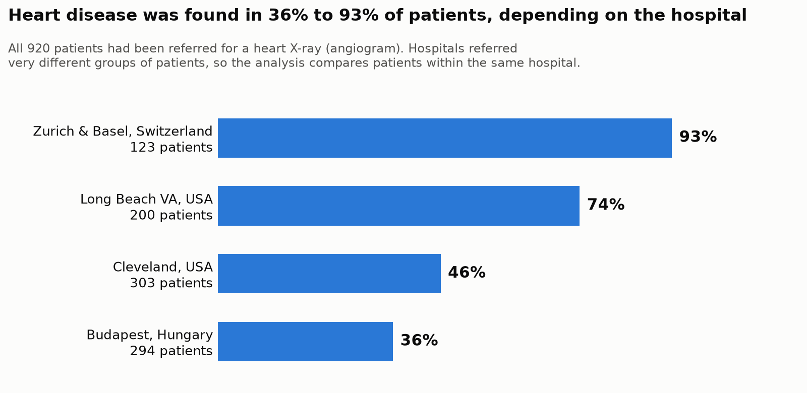
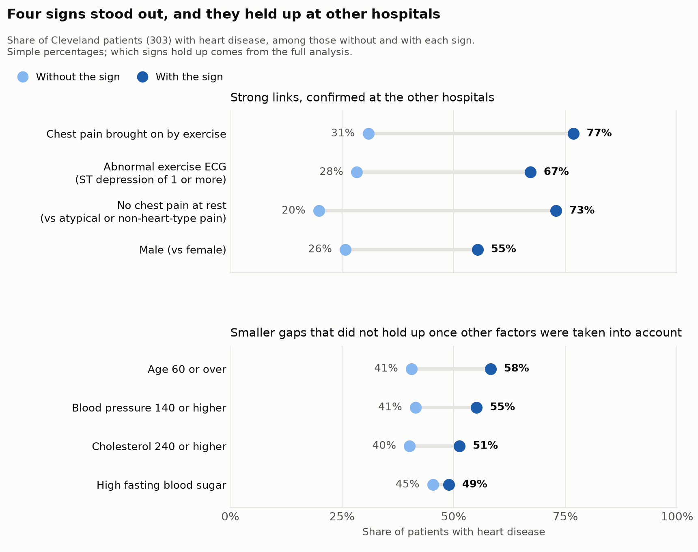
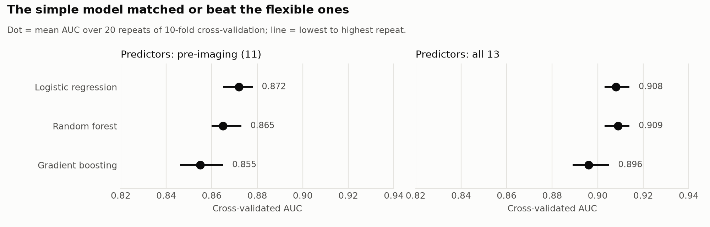

# Which Warning Signs Go With Heart Disease? A Four-Hospital Analysis

*An end-to-end analytics case study using the UCI Heart Disease dataset
(920 patients, four hospitals).*

---

## The short version

**The question.** When a doctor suspects heart disease, one test they can
order is an angiogram: dye goes into the heart's arteries and an X-ray shows
whether they're narrowed. Everyone in this data had one. I wanted to know
which of the everyday measurements taken *before* that test, from a check-up
and a treadmill exercise test, actually line up with what the angiogram
found. And whether the answer survives a move to a different hospital.

**What I found.**

1. **Four signs stood out, and they held up at three other hospitals.**
   Patients with any of these were far more likely to have heart disease:
   - **Chest pain brought on by exercise:** 77% had heart disease, against 31% of those without it.
   - **An abnormal reading on the exercise heart tracing (ECG):** 67% vs 28%.
   - **Being male:** 55% vs 26%.
   - **No chest pain at rest**, compared with chest pain that didn't fit the classic heart pattern: 73% vs 20%.

   That last one surprised me too. My best explanation is how people end up
   on the angiogram table. Someone with no chest pain was probably sent
   because a different test had already come back abnormal. That's a
   hypothesis, though. The data can't prove it.

2. **Some of the most famous risk factors barely told the groups apart.**
   Cholesterol, blood pressure, blood sugar and, once the other signs were
   accounted for, age. That doesn't mean they don't matter for your heart.
   Everyone here had already been flagged as high-risk, and inside a group
   like that these factors lose most of their power to separate people.

3. **Routine measurements get you most of the way there.** Using only
   check-up and exercise-test results, the model picked out the patient with
   disease in **87 of 100** random pairs (one patient with disease, one
   without). Adding specialised heart imaging raised that to **90 of 100**.
   Useful, but not the leap you'd expect. I also tried two
   machine-learning models, a random forest and gradient boosting. Neither
   beat the simple model, which is good news: the model you can explain to a
   doctor is also the one that predicts best here.

4. **The hospital mattered as much as the patient.** Between 36% and 93% of
   patients had heart disease, depending on where they were tested. A model
   built in Cleveland ranked patients well in Budapest. In Switzerland, where
   almost everyone had the disease, it guessed far too low.





### The scorecard

| Sign | Cleveland | Three other hospitals | Verdict |
|---|---|---|---|
| Abnormal exercise ECG (ST depression) | ✅ strong | ✅ strong | **Confirmed** |
| Chest pain brought on by exercise | ✅ strong | ✅ strong | **Confirmed** |
| Male sex | ✅ strong | ✅ strong | **Confirmed** |
| No chest pain vs atypical / non-heart-type pain | ✅ strong | ✅ strong | **Confirmed** |
| No chest pain vs *classic* heart-type chest pain | ✅ strong | ❌ not seen | **Not confirmed** (few patients) |
| Maximum heart rate during exercise | ✅ moderate | ➖ unclear | **Weaker elsewhere** |
| Age, blood pressure, cholesterol, blood sugar, resting ECG | ➖ | ➖ | **No clear link** once other factors are accounted for |

### What this doesn't show

- **It's not health advice.** These are people who'd already been sent for
  heart testing, in data that was donated to UCI in 1988.
- **It shows links, not causes.** A sign that goes along with heart disease
  isn't necessarily causing it.
- **It's not a diagnostic tool.** I built these models to understand the
  data, not to make decisions about anyone's care.

**Where it falls short.** The biggest gap is missing data at the Long Beach
VA. Patients without heart disease were dropped more often than patients
with it, which can tilt the results. Next, I'd fill those gaps with multiple
imputation (a way of estimating missing values several times over to show
how uncertain they are) and check whether the four-hospital findings still
hold.

---

## Detailed analysis

### 1. Data

| | |
|---|---|
| Source | [UCI Machine Learning Repository, dataset #45](https://archive.ics.uci.edu/dataset/45/heart+disease), DOI [10.24432/C52P4X](https://doi.org/10.24432/C52P4X) |
| License | CC BY 4.0 |
| Citation | Janosi, A., Steinbrunn, W., Pfisterer, M., & Detrano, R. (1989). Heart Disease [Dataset]. UCI Machine Learning Repository. |
| Patients | 920 across Cleveland (303), Budapest (294), Zurich & Basel (123), Long Beach VA (200) |
| Outcome | Angiographic diagnosis: > 50% narrowing of any major coronary artery = disease |
| Predictors | 13 clinical measurements: demographics, chest pain type, resting measurements, exercise-test results, imaging |

**Why the original UCI files and not the popular Kaggle version:** the widely
shared Kaggle file (`heart.csv`, 1,025 rows) consists largely of duplicated
records of the same ~300 patients, which inflates the sample size and any
model's apparent accuracy.

**Reproducibility.** A download script fetches the files and pins their
SHA-256 checksums. Raw files are never edited. Every later step is a script
or an executed notebook committed with its outputs.

### 2. Data quality and cleaning

Checking the files against their documentation found six problems. Each
became a logged cleaning decision (README, D1–D8), and a verification
notebook proves that nothing else changed.

| Problem | Decision |
|---|---|
| Missing values written as `?`, not the documented `-9` | Read `?` as missing |
| Cholesterol recorded as `0` for all Swiss patients and 49 VA patients; one blood pressure of `0` | Treated as missing (a value of zero is physiologically impossible) |
| Hungarian diagnoses collapsed from 0–4 severity to 0/1 | Target defined as disease yes/no (comparable at every site); severity left blank for Hungarian positives |
| Some measurements missing at most non-Cleveland sites (vessel count 96–99% missing, thallium 42–90%) | Cleveland used as the primary sample; the four-site check limited to 7 predictors recorded everywhere |
| Two pairs of identical rows | Kept and flagged; a sensitivity check showed removing them changes nothing (≤ 3.6%) |
| Codes and cryptic column names | Decoded to labels, renamed, typed (nullable integers, booleans, ordered categories) |


### 3. Methods

The analysis moved from simple to adjusted to replicated, so that each
step checks the one before it:

| Step | Question | Method |
|---|---|---|
| Profile | How do patients with and without disease differ, one variable at a time? | Medians and interquartile ranges; disease rate per category |
| Tests | Are those differences bigger than chance, and how big are they? | Mann–Whitney U with probability of superiority; chi-square (permutation-based for small cells) with Cramér's V; 95% bootstrap confidence intervals; Holm correction for 13 tests |
| Model | Which predictors still matter when the others are held constant? | Logistic regression, odds ratios with 95% CIs. Model A: 11 pre-imaging predictors. Model B: adds vessel count and thallium. Likelihood-ratio test; AUC under 20× repeated stratified 10-fold cross-validation |
| ML comparison | Does a more flexible model predict better? | Logistic regression vs random forest vs gradient boosting on identical 20× repeated 10-fold splits; AUC, Brier score, calibration curves, permutation importance on held-out folds |
| Replication | Do the findings hold at other hospitals? | Same 7-predictor model fitted at Cleveland and at the other three sites (with a site term); interaction test; the Cleveland model transported to each site (AUC with bootstrap CIs, calibration) |

### 4. Results

#### 4.1 One variable at a time (Cleveland, n = 303)

Ten of the 13 predictors differ between the groups even after correcting for
multiple testing. The largest differences are in the thallium result
(Cramér's V 0.53), chest pain type (0.52), vessel count (0.49), ST depression
(probability of superiority 0.74) and max heart rate (0.25, i.e. lower with
disease). Cholesterol and resting blood pressure reach p < 0.05 when tested
alone but not after the Holm correction (both p = 0.078), and their effects
are small. Fasting blood sugar shows no association.


#### 4.2 Adjusted for each other (Cleveland, n = 297 complete cases)

- **Age loses its association** (Model A OR 1.25 per 10 years, 95% CI
  0.82–1.91). It overlaps with max heart rate (r = −0.39) and vessel count
  (r = 0.36).
- **Sex gets stronger** (OR 7.5, 3.3–17.2, against 3.6 unadjusted). The
  women in this sample are slightly older and have higher cholesterol, which
  masked part of the gap.
- **The four exercise-test measures overlap.** Only ST depression (OR 1.82 per
  unit) and max heart rate (0.82 per 10 bpm) remain clear in Model A.
- **Imaging adds information** (likelihood-ratio p ≈ 2 × 10⁻⁹). Each diseased
  vessel multiplies the odds by 3.7, and a reversible thallium defect by 4.0.
  But cross-validated AUC rises only from **0.87 to 0.90**. Both imaging
  measures come from procedures close to the diagnosis itself, so part of
  their strength is built in.
- AUC on the fitting data was about 0.03 higher than cross-validated AUC.
  That gap is over-fitting, and it is why the cross-validated figures are
  the ones reported.


#### 4.3 Replication at three other hospitals (n = 550)

| Predictor (core model) | Cleveland OR (95% CI) | Other three sites OR (95% CI) |
|---|---|---|
| ST depression, per unit | 1.97 (1.40–2.76) | 1.86 (1.36–2.53) |
| Exercise-induced angina | 2.20 (1.06–4.58) | 3.74 (2.04–6.84) |
| Male | 5.91 (2.76–12.65) | 2.92 (1.42–6.01) |
| Atypical angina vs asymptomatic | 0.22 (0.08–0.58) | 0.11 (0.05–0.24) |
| Non-anginal pain vs asymptomatic | 0.13 (0.06–0.30) | 0.29 (0.16–0.55) |
| Typical angina vs asymptomatic | 0.10 (0.03–0.32) | 1.35 (0.39–4.72) |
| Max heart rate, per 10 bpm | 0.80 (0.67–0.96) | 0.94 (0.83–1.06) |

- **Five associations replicate.** Typical angina does not (interaction
  p = 0.003), but that comparison rests on only 23 and 18 patients.
- **Site baselines differ hugely.** At the same measurements, Swiss patients
  have about 14 times the odds of disease of Cleveland patients.
- **Transport of the Cleveland model:**

| Site | AUC (95% CI) | Observed / predicted % with disease |
|---|---|---|
| Hungary | 0.87 (0.82–0.91) | 36 / 43 |
| Switzerland | 0.75 (0.58–0.90) | 93 / 70 |
| VA | 0.73 (0.62–0.82) | 79 / 81 |

The model ranks Hungarian patients as well as its own, but under-predicts
Swiss risk badly. Ranking patients well (discrimination) and getting the
risk levels right (calibration) are separate properties.


#### 4.4 Machine-learning comparison (Cleveland, n = 297)

Logistic regression was compared with a random forest and gradient boosting,
all scored on the same cross-validation splits. The tree models used
conservative, fixed hyperparameters (not tuned, since tuning on 297 patients
would itself over-fit).

| Predictors | Logistic regression | Random forest | Gradient boosting |
|---|---|---|---|
| Pre-imaging (11), AUC | **0.872** | 0.865 | 0.855 |
| All 13, AUC | 0.908 | **0.909** | 0.896 |
| Pre-imaging (11), Brier score (lower is better) | **0.145** | 0.150 | 0.154 |

- **The simple model held its own.** With routine predictors, neither tree
  model beat logistic regression in any of the 20 repeats. With all 13, the
  random forest tied it (ahead in 13 of 20 repeats, by at most 0.006).
- **All three models agree on the top three signals,** in the same order:
  chest pain type, sex and ST depression. Cholesterol, resting ECG and fasting
  blood sugar sit near zero for all three.
- **The tree models gave age more weight** (ranked 5th–6th vs 10th), possibly
  through combinations with other predictors. It's a lead, not a finding: the
  effect is small and the trees didn't predict better.
- **Conclusion:** extra complexity isn't worth its cost in interpretability
  here, so the logistic regression, whose odds ratios can be explained to a
  clinician, is the model to keep.



### 5. Limitations

- **Referred patients only.** Every patient was sent for angiography. This
  pre-selects a high-suspicion group (known as spectrum or referral bias).
  Risk factors that separate healthy people from patients can look weak here.
- **Imaging close to the outcome.** Vessel count and thallium come from
  procedures close to the diagnosis itself, so their strength is partly built in.
- **Missing data is not random at VA.** 41% of VA patients without disease
  were dropped for missing values, against 26% of those with disease.
- **Sample size.** The Cleveland models have 8–10 disease cases per
  coefficient, at the edge of the usual rule of thumb. Small categories have
  wide intervals.
- **Age of the data.** It was collected before the 1988 donation, and
  diagnostic practice has changed since.
- **Associations, not causes.**

### 6. What I would do next

- **Multiple imputation** for missing values, instead of dropping patients,
  to test whether complete-case analysis biased the four-site results.
- **Penalised (ridge/lasso) regression** to stabilise the models near the
  sample-size limit, and **nested cross-validation** to tune the tree models
  fairly.
- **Calibration curves and recalibration** of the transported model for each site.
- **A mixed-effects model** with a random intercept for site, as an
  alternative to the fixed site term.

### 7. Reproduce it

```bash
python3 -m venv .venv && source .venv/bin/activate
pip install -r requirements.txt
python src/download_data.py        # downloads and verifies raw data (checksums)
python src/check_structure.py      # compares files with their documentation
python src/clean_data.py           # writes data/processed/heart_clean.csv
python src/make_report_figures.py  # story charts
jupyter nbconvert --to notebook --execute --inplace notebooks/0*.ipynb
```

| Notebook | Content |
|---|---|
| [`02_cleaning_check`](../notebooks/02_cleaning_check.ipynb) | Proves cleaning changed only what the decision log says |
| [`03_cleveland_profile`](../notebooks/03_cleveland_profile.ipynb) | One-variable profile |
| [`04_cleveland_tests`](../notebooks/04_cleveland_tests.ipynb) | Effect sizes, confidence intervals, corrected tests |
| [`05_cleveland_model`](../notebooks/05_cleveland_model.ipynb) | Logistic regression, cross-validation |
| [`06_four_site_check`](../notebooks/06_four_site_check.ipynb) | Replication and transport |
| [`07_model_comparison`](../notebooks/07_model_comparison.ipynb) | Logistic regression vs random forest vs gradient boosting |
